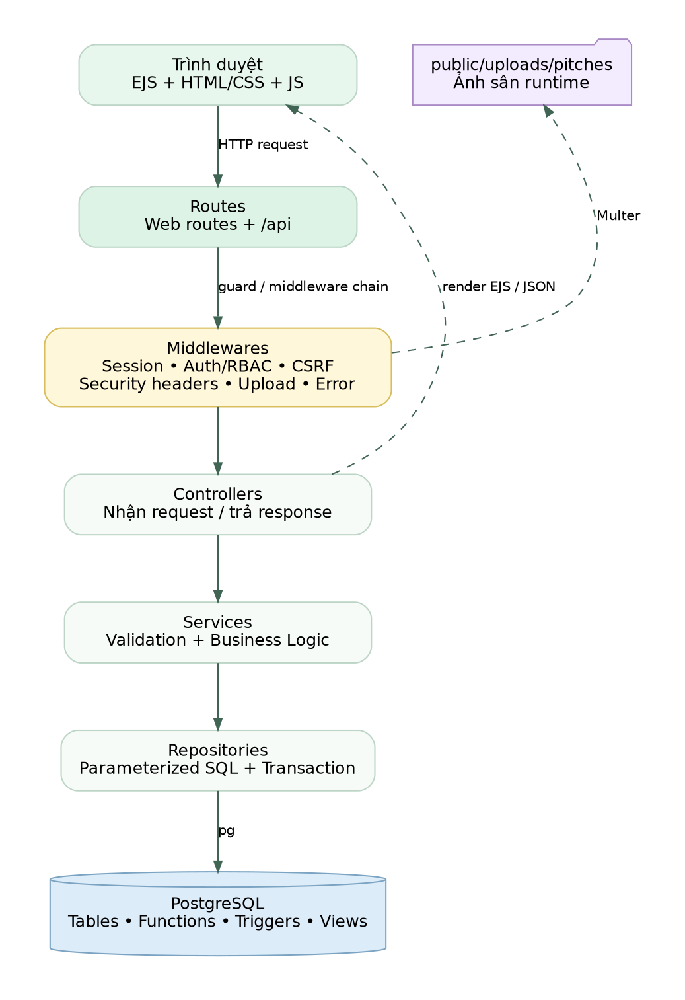
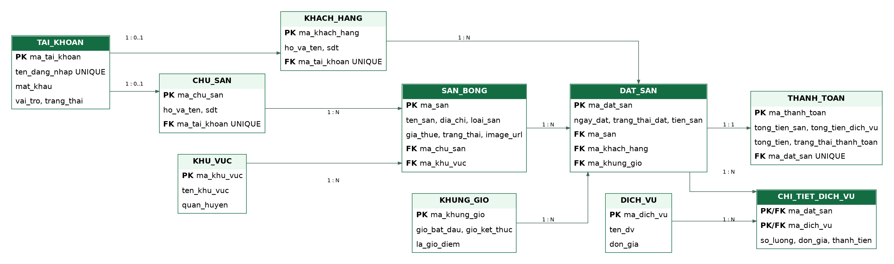

# FootballBookingSystem

A role-based football pitch booking and management platform built with **Node.js, Express, EJS, and PostgreSQL**.

The project covers the complete booking flow for customers, pitch owners, and administrators: pitch discovery, availability checking, booking, services, invoicing, payment simulation, owner operations, and system-wide administration.

> Current stable development version: **v1.0.4**  
> Automated tests: **51 / 51 passed**

## Highlights

- Role-based experience for **Customer / Pitch Owner / Admin**.
- PostgreSQL functions and triggers are used for core booking and billing rules.
- Layered backend architecture: `Route -> Middleware -> Controller -> Service -> Repository -> PostgreSQL`.
- Session authentication stored in PostgreSQL.
- Password hashing with bcrypt.
- CSRF protection and security headers.
- Responsive server-rendered UI with EJS.
- Pitch image upload support.
- Automated project audit, structure verification, unit tests, and database smoke checks.

## Product Roles

### Customer

- Register, sign in, and manage an account.
- Search pitches by keyword, area, pitch type, and price.
- View pitch details and available time slots.
- Create and cancel eligible bookings.
- Track booking history and booking status.
- Add optional services to a confirmed booking.
- View invoices and complete simulated payments.

### Pitch Owner

- View an operational dashboard.
- Create and update owned pitches.
- Upload pitch cover images.
- Change pitch operating status.
- Review bookings belonging to owned pitches.
- Confirm pending bookings.
- Track paid revenue and upcoming activity.

### Administrator

- View platform-level operational metrics.
- Search, lock, and unlock accounts.
- Manage service areas.
- Monitor pitches, bookings, and invoices.
- Review customer, revenue, service, and cancellation statistics.

## Tech Stack

| Layer | Technology |
|---|---|
| Runtime | Node.js |
| Web framework | Express.js |
| Server-side UI | EJS + HTML/CSS/JavaScript |
| Database | PostgreSQL |
| Database client | `pg` |
| Authentication | `express-session` + `connect-pg-simple` |
| Password hashing | `bcryptjs` |
| File upload | Multer 2.x |
| Development | Nodemon |
| Testing | Node.js built-in test runner |

## Architecture

The application follows a layered architecture so HTTP concerns, business rules, and SQL access stay separated.

```text
Browser
  |
  v
Routes
  |
  v
Middleware
  |
  v
Controllers
  |
  v
Services
  |
  v
Repositories
  |
  v
PostgreSQL
```



More diagrams are available in [`diagrams/`](diagrams/), including the ERD, use cases, and booking sequence.

## Database Design

The database contains the main entities for accounts, customers, owners, areas, pitches, time slots, bookings, services, booking service details, and payments.

Core database logic includes:

- booking conflict validation;
- automatic pitch fee calculation;
- automatic invoice creation;
- service line total calculation;
- invoice total synchronization;
- booking confirmation and cancellation;
- payment status updates.



See [`docs/Database.md`](docs/Database.md) for the database overview and SQL organization.

## Security

The project includes:

- bcrypt password hashing;
- PostgreSQL-backed sessions;
- CSRF tokens for state-changing forms;
- role-based authorization middleware;
- parameterized SQL access;
- Content Security Policy;
- `X-Frame-Options`, `X-Content-Type-Options`, `Referrer-Policy`, and `Permissions-Policy` headers;
- `Cache-Control: no-store` for authenticated and sensitive pages;
- request body limits;
- production validation for database credentials and session secrets.

See [`docs/Security.md`](docs/Security.md) for details.

## Testing and Quality Checks

The current project passes **51 / 51 automated tests**.

Useful commands:

```bash
npm test
npm run verify
npm run audit
npm run check
npm run db:check
```

- `npm test` runs unit tests.
- `npm run verify` validates project structure, internal imports, and EJS syntax.
- `npm run audit` checks security and architecture invariants.
- `npm run check` runs verify + audit + unit tests.
- `npm run db:check` performs checks against the configured PostgreSQL database.

See [`docs/TestPlan.md`](docs/TestPlan.md) for the test strategy.

## Project Structure

```text
FootballBookingSystem/
├── database/                 # Schema, seed data, functions, triggers, views, migrations
├── diagrams/                 # ERD, use case, architecture, booking sequence
├── docs/                     # API, database, deployment, security, tests, user guide
├── public/
│   ├── css/
│   ├── images/
│   ├── js/
│   └── uploads/              # Runtime uploads are ignored by Git
├── scripts/                  # Verify, audit, database checks
├── src/
│   ├── config/
│   ├── controllers/
│   ├── middlewares/
│   ├── repositories/
│   ├── routes/
│   ├── services/
│   └── utils/
├── tests/
│   ├── database/
│   └── unit/
├── views/
├── .env.example
├── package.json
└── README.md
```

## Getting Started

### Prerequisites

- Node.js 20+
- PostgreSQL 15+
- npm

### 1. Clone and install

```bash
git clone https://github.com/tuyennt-hust/FootballBookingSystem.git
cd FootballBookingSystem
npm install
```

### 2. Create the database

```bash
psql -U postgres -c "CREATE DATABASE dat_san_bong;"
psql -U postgres -d dat_san_bong -v ON_ERROR_STOP=1 -f database/01_schema.sql
psql -U postgres -d dat_san_bong -v ON_ERROR_STOP=1 -f database/02_seed.sql
psql -U postgres -d dat_san_bong -v ON_ERROR_STOP=1 -f database/03_functions.sql
psql -U postgres -d dat_san_bong -v ON_ERROR_STOP=1 -f database/04_triggers.sql
psql -U postgres -d dat_san_bong -v ON_ERROR_STOP=1 -f database/05_views.sql
```

`06_queries.sql` and `07_big_data.sql` are not required for normal application startup.

### 3. Configure environment variables

Windows PowerShell:

```powershell
Copy-Item .env.example .env
```

Linux/macOS:

```bash
cp .env.example .env
```

Update at least:

```env
DB_PASSWORD=your_postgresql_password
SESSION_SECRET=replace_with_a_long_random_secret
```

### 4. Start the application

```bash
npm run dev
```

Open:

```text
http://localhost:3000
http://localhost:3000/api/health
```

## Demo Accounts

The seed database includes local demo accounts:

| Role | Username | Password |
|---|---|---|
| Customer | `khach01` | `123456` |
| Pitch Owner | `chusan01` | `123456` |
| Admin | `admin` | `123456` |

These credentials are intended for **local/demo use only**.

## Main Routes

| Route | Purpose |
|---|---|
| `/` | Home page |
| `/san-bong` | Pitch discovery |
| `/dang-nhap` | Sign in |
| `/dang-ky` | Customer registration |
| `/lich-su-dat-san` | Customer booking history |
| `/chu-san` | Pitch owner dashboard |
| `/admin` | Admin dashboard |
| `/api/health` | Application/database health check |

API details are documented in [`docs/API.md`](docs/API.md).

## Documentation

- [`docs/API.md`](docs/API.md) — API reference
- [`docs/Database.md`](docs/Database.md) — database design and SQL organization
- [`docs/Deployment.md`](docs/Deployment.md) — deployment guide
- [`docs/Security.md`](docs/Security.md) — security controls
- [`docs/TestPlan.md`](docs/TestPlan.md) — testing strategy
- [`docs/UIUX.md`](docs/UIUX.md) — UI/UX design notes
- [`docs/UserGuide.md`](docs/UserGuide.md) — user workflows
- [`docs/README.md`](docs/README.md) — documentation index

## Known Limitations

- Payment is simulated inside the application; no real payment gateway is integrated yet.
- Uploaded pitch images are stored on the local filesystem rather than object/cloud storage.
- The current UI is primarily Vietnamese.
- Email/SMS/push notifications are not implemented.

## Possible Next Improvements

- VNPay/MoMo/Stripe payment integration.
- Cloud image storage such as S3-compatible object storage.
- Booking confirmation notifications.
- Production deployment with CI/CD.
- Additional integration and end-to-end tests.

## Development Status

The core booking system, owner operations, admin operations, security checks, responsive UI, and automated test suite are complete. Future work is focused on presentation assets, deployment, and optional integrations rather than core booking functionality.
